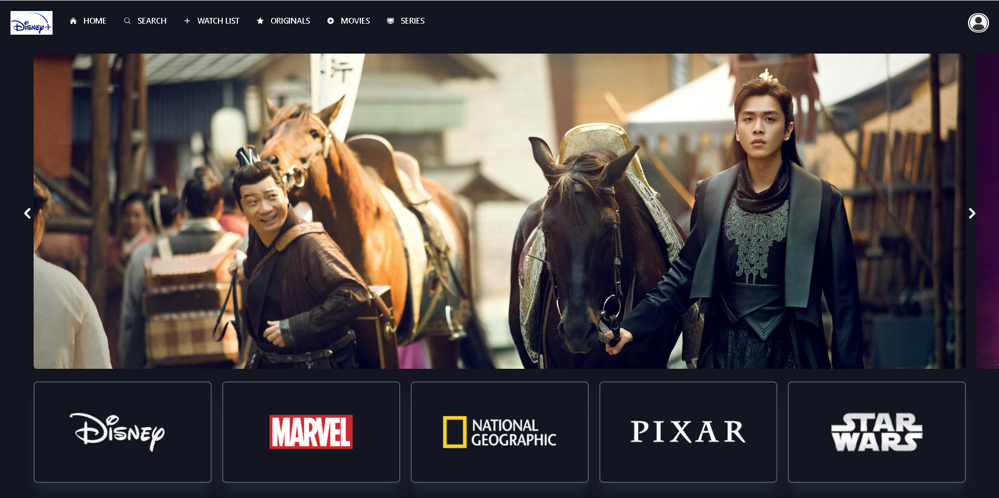

# Disney-Clone

Welcome to the Disney-Clone project! This is a fully responsive web application built using the React library and the Disney API. The application mimics the Disney+ platform, providing a seamless and engaging user experience.

## Features

- **Responsive Design:** Fully responsive design that works on desktops, tablets, and mobile devices.
- **React Library:** Built using the powerful and flexible React library.
- **Disney API Integration:** Fetches data directly from the Disney API to display movies and TV shows.
- **Modern UI:** Clean and modern user interface inspired by Disney+.

## Demo

Check out the live demo [here](https://disney-clone-addy.vercel.app/).

## Screenshots



## Installation

1. Clone the repository:
    ```bash
    git clone https://github.com/aadarsh2305/Disney-clone.git
    cd disney-clone
    ```

2. Install dependencies:
    ```bash
    npm install
    ```

3. Start the development server:
    ```bash
    npm run dev
    ```

The application will be available at `http://localhost:5173`

